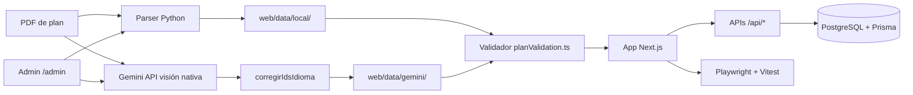

# UNS Correlativas Parser + Web

Pipeline completo que convierte planes de estudio en PDF a JSON estructurado y los publica en una app web con progreso por usuario.

## 1) Que resuelve este proyecto

Transforma planes de estudio UNS (PDF) en JSON valido para:
- visualizar materias y correlativas por carrera,
- gestionar el progreso del usuario (cursada/aprobada),
- operar roles (USER, MODERATOR, ADMIN) con auditoria,
- evaluar la calidad del output de Gemini vs. parser local.

## 2) Arquitectura de alto nivel



## 3) Estructura principal del repositorio

```text
.
|-- core/
|   `-- parser/           # Parser PDF: extraccion, correlativas, contrato
|       |-- parser_plan.py
|       |-- correlativa_prosa.py   # Deteccion de requisito_especial en prosa
|       `-- contract_validator.py
|-- scripts/
|   `-- comparar_json.py  # Evalua similitud ref vs. candidato (score /100)
|-- tests/                # Tests parser + contrato + fixtures PDF
|-- pdf/                  # PDFs de planes (fixtures)
`-- web/
    |-- app/
    |   |-- api/admin/planes/
    |   |   |-- parsear/      # Gemini (SSE): PDF → JSON + corregirIdsIdioma
    |   |   |-- parsear-local/# Parser Python (SSE)
    |   |   |-- guardar/      # Persiste JSON en data/
    |   |   |-- existe/       # Chequea si ya hay borrador guardado
    |   |   |-- validar/      # Compara con ground truth via comparar_json.py
    |   |   `-- enviar-revision/ # Envio a revisión (MODERATOR → ADMIN)
    |   `-- admin/revisiones/ # Vista de revisión de planes pendientes
    |-- components/
    |   |-- admin/
    |   |   |-- tabs/CargarPlanTab.tsx    # Flujo subida PDF + comparacion
    |   |   |-- tabs/DiffExportDrawer.tsx # Exportacion few-shot
    |   |   `-- tabs/ConfigTab.tsx        # Prompt, version, modelo
    |   `-- materias/MateriaCard.tsx      # Muestra requisito_especial[]
    |-- data/
    |   |-- local/        # JSONs generados por parser Python (ground truth)
    |   |-- gemini/       # JSONs generados por Gemini (borradores)
    |   `-- admin-config.json  # Prompt activo + version
    `-- lib/
        |-- ai/prompt.ts  # DEFAULT_SYSTEM_PROMPT + PROMPT_VERSION (v30)
        |-- plan/
        |   |-- evaluarCorrelativas.ts
        |   `-- requisitoEspecial.ts  # Tipos y evaluacion de requisito_especial[]
        `-- data/planValidation.ts    # Parseo y validacion del schema PlanData
```

## 4) Flujo de procesamiento: PDF → JSON de Gemini

```
Usuario sube PDF en /admin
        │
        ▼
[1] /api/admin/planes/existe
    Verifica si ya existe borrador guardado para ese PDF
        │
        ▼
[2] /api/admin/planes/parsear  (SSE)
    1. Lee PDF como base64
    2. Lee systemPrompt de admin-config.json (fallback: DEFAULT_SYSTEM_PROMPT)
    3. Llama a Gemini con visión nativa (temperature=0)
    4. extraerJSON()       → parsea la respuesta como JSON
    5. corregirIdsIdioma() → corrige 1XXXX → IXXXX automáticamente
    6. Anota _llm_prompt_version y _llm_mode
    7. Devuelve JSON via SSE

        │  (en paralelo, opcional)
        ▼
   /api/admin/planes/parsear-local  (SSE)
    1. Guarda PDF en /tmp
    2. Ejecuta: python3 -m core.parser <pdf> <output.json>
    3. Devuelve JSON via SSE
        │
        ▼
[3] Panel muestra ambos side-by-side con diff
        │
        ▼
[4] /api/admin/planes/guardar
    Escribe JSON en data/gemini/ o data/local/
    Si publicar=true, actualiza carreras.ts
        │
        ▼
[5] (Opcional) /api/admin/planes/enviar-revision
    MODERATOR envía para aprobación → ADMIN revisa en /admin/revisiones/[slug]
```

## 5) Schema JSON (PlanData)

```json
{
  "plan": { "carrera": "string", "universidad": "string", "codigo_plan": "string" },
  "materias": [{
    "id": "string",
    "nombre": "string",
    "año": "Primer Año | ... | Sexto Año | null",
    "cuatrimestre": "Primer Cuatrimestre | Segundo Cuatrimestre | null",
    "horas": "string",
    "tipo": "materia | agrupador_requisito",
    "categoria": "normal | optativa",
    "grupo_opcion": "string | null",
    "subtipo": "idioma | null",
    "correlativas": { "<id>": { "para_cursar": "cursada|aprobada|null", "para_rendir": "cursada|aprobada|null" } },
    "requisito_especial": [
      { "tipo": "anio_aprobado", "anio": 3, "descripcion": "string" },
      { "tipo": "cuatrimestre_cursado", "anio": 4, "cuatrimestre": 1, "descripcion": "string" }
    ]
  }],
  "agrupadores": [{ "id": "string", "nombre": "string", "tipo": "optativa_grupo|idioma_grupo", "opciones": ["string"], "año": "string", "cuatrimestre": "string" }]
}
```

`requisito_especial` es un **array** (puede tener 0, 1 o 2 entradas por materia). Tipos soportados: `anio_aprobado`, `cuatrimestre_cursado`, `minimo_materias_aprobadas`, `prueba_idioma`, `todas_materias_aprobadas`.

## 6) Post-procesamiento automático de Gemini

Solo hay dos transformaciones que se aplican al output de Gemini en el servidor:

1. **`extraerJSON()`** — parsea el texto como JSON tolerando bloques markdown.
2. **`corregirIdsIdioma()`** — reemplaza `1XXXX` → `IXXXX` en `materias[].id`, `materias[].correlativas` y `agrupadores[].opciones`. Heurística: un ID de 5 dígitos empezando con `1` nunca es una materia real en los planes UNS.

## 7) Prompt Gemini

- Versión actual: **v30** — `web/lib/ai/prompt.ts`
- La versión siempre se lee del código fuente (no del JSON guardado).
- El prompt activo se puede editar desde `/admin` → tab Configuración y se persiste en `web/data/admin-config.json`.
- El panel admin incluye la herramienta **"Exportar diff como few-shot"** que genera bloques de corrección para mejorar el prompt manualmente.

### Scores Gemini v30 por carrera

| Carrera | Score |
|---|---|
| Ingenieria Electricista | 98.9/100 |
| Ingenieria en Sistemas de Informacion | 98.7/100 |
| Ingenieria Agronomica | 98.6/100 |
| Agrimensura | 98.6/100 |
| Contador Publico | 95.6/100 |
| Arquitectura | 95.9/100 |
| Bioquimica | 90.8/100 |
| Abogacia | 89.5/100 |
| Farmacia | 86.0/100 |
| Ingenieria en Computacion | 93.6/100 |
| Ingenieria Civil | 23.0/100 (fallo estructural: orientaciones multiples) |

## 8) Requisitos

- Node.js 20+
- Python 3.11+
- PostgreSQL

## 9) Setup rapido

### Parser Python

```bash
python3 -m venv .venv
source .venv/bin/activate
pip install -r requirements.txt
```

Generar JSON desde PDF:

```bash
python3 -m core.parser pdf/arquitectura.pdf web/data/local/arquitectura.json
```

Comparar dos JSONs:

```bash
python3 -m scripts.comparar_json web/data/local/carrera.json web/data/gemini/carrera.json
```

### Web (Next.js)

```bash
cd web
npm install
cp .env.example .env.local
npm run dev
```

Variables de entorno clave:

| Variable | Descripcion |
|---|---|
| `DATABASE_URL` | PostgreSQL |
| `AUTH_SECRET` | NextAuth secret |
| `GEMINI_API_KEY` | Requerida para parsear con Gemini |
| `RESEND_API_KEY` | Notificaciones email al admin |
| `ADMIN_NOTIFY_EMAIL` | Email del admin para notificaciones |

## 10) Testing

### Parser Python

```bash
python3 -m pytest tests/ --ignore=tests/test_parser_fixtures.py -q
```

### Web (Vitest)

```bash
cd web && npm test -- --run
```

### E2E (Playwright)

```bash
cd web && npm run test:e2e
```

### Validacion batch de datos

```bash
cd web && npm run validate:data
```

## 11) Endpoints API principales

| Endpoint | Descripcion |
|---|---|
| `POST /api/admin/planes/parsear` | Gemini (SSE stream) |
| `POST /api/admin/planes/parsear-local` | Parser Python (SSE stream) |
| `POST /api/admin/planes/guardar` | Persiste JSON |
| `GET /api/admin/planes/existe` | Chequea borrador existente |
| `POST /api/admin/planes/validar` | Compara con ground truth |
| `POST /api/admin/planes/enviar-revision` | Envio a revision |
| `GET /api/admin/config` | Lee prompt activo + version |
| `POST /api/admin/config` | Guarda prompt customizado |
| `GET /api/materias/[carrera]` | Materias de una carrera |
| `GET|PUT /api/progreso` | Progreso del usuario |

## 12) Reglas de dominio

### Correlativas

- `para_cursar`: requisito para inscribirse a la materia.
- `para_rendir`: requisito para rendir el examen final.
- Puede referenciar una materia (ID numerico) o un agrupador (`G####` o `I####`).

### requisito_especial

Cuando el PDF tiene texto en prosa como condicion adicional (no expresable como ID de correlativa), se captura en `requisito_especial[]`. Ejemplo:

```json
"requisito_especial": [
  { "tipo": "anio_aprobado", "anio": 3, "descripcion": "tercer año aprobado" },
  { "tipo": "cuatrimestre_cursado", "anio": 4, "cuatrimestre": 1, "descripcion": "primer cuatrimestre de cuarto año" }
]
```

### IDs de idioma (I####)

Los IDs de grupos de idioma empiezan con la letra `I` (no el digito `1`). Gemini frecuentemente los confunde. El post-proceso `corregirIdsIdioma()` los corrige automaticamente.

### Roles

- `USER`: acceso a la app, gestiona su propio progreso.
- `MODERATOR`: puede subir y procesar PDFs, no puede publicar.
- `ADMIN`: puede publicar planes, gestionar usuarios y revisar envios de moderadores.

## 13) Publicar una nueva carrera

### Via panel admin (recomendado)

1. Ir a `/admin` → "Cargar plan".
2. Subir el PDF → ejecutar Gemini y/o parser local.
3. Comparar side-by-side, validar, guardar borrador.
4. Publicar (ADMIN) o enviar a revision (MODERATOR).

### Via CLI

```bash
python3 -m core.parser pdf/carrera.pdf web/data/local/carrera.json
cd web && npm run validate:data
```

## 14) Documentacion complementaria

- Contrato parser: `core/parser/contract_validator.py`
- Tipos de datos web: `web/app/types/plan.ts`
- Validacion schema: `web/lib/data/planValidation.ts`
- Schema DB: `web/prisma/schema.prisma`
- Issues por carrera: `issues/*.md`
