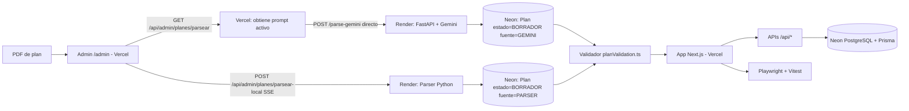

# UNS Correlativas Parser + Web

Pipeline completo que convierte planes de estudio en PDF a JSON estructurado y los publica en una app web con progreso por usuario.

## 1) Que resuelve este proyecto

Transforma planes de estudio UNS (PDF) en JSON valido para:
- visualizar materias y correlativas por carrera,
- gestionar el progreso del usuario (cursada/aprobada),
- operar roles (USER, MODERATOR, ADMIN) con auditoria,
- evaluar la calidad del output de Gemini vs. parser local.

## 2) Arquitectura de alto nivel



## 3) Estructura principal del repositorio

```text
.
|-- frontend/                  # App Next.js (presentación + lógica + BD)
|   |-- app/
|   |   |-- api/admin/planes/
|   |   |   |-- parsear/         # Gemini: PDF → JSON + autoguarda en Plan (BORRADOR)
|   |   |   |-- parsear-local/   # Parser Python (SSE) + autoguarda en Plan (BORRADOR)
|   |   |   |-- guardar/         # Plan BORRADOR → PUBLICADO + crea/actualiza CarreraVersion
|   |   |   |-- existe/          # Chequea borradores en Plan por fuente
|   |   |   |-- validar/         # Compara con ground truth via comparar_json.py
|   |   |   `-- enviar-revision/ # Envio a revision (MODERATOR → ADMIN)
|   |   `-- admin/               # Panel de administracion
|   |-- components/
|   |   |-- admin/
|   |   |   |-- tabs/CargarPlanTab.tsx    # Flujo subida PDF + comparacion
|   |   |   |-- tabs/DiffExportDrawer.tsx # Exportacion few-shot
|   |   |   `-- tabs/ConfigTab.tsx        # Prompt, version, modelo
|   |   `-- materias/MateriaCard.tsx      # Muestra requisito_especial[]
|   |-- lib/
|   |   |-- ai/prompt.ts          # DEFAULT_SYSTEM_PROMPT + PROMPT_VERSION (v33)
|   |   |-- plan/
|   |   |   |-- evaluarCorrelativas.ts
|   |   |   `-- requisitoEspecial.ts  # Tipos y evaluacion de requisito_especial[]
|   |   |-- db/carreraRepository.ts   # CRUD de Carrera y CarreraVersion
|   |   `-- data/planValidation.ts    # Parseo y validacion del schema PlanData
|   `-- prisma/schema.prisma          # Schema BD
|-- parser/                    # Parser Python + API FastAPI
|   |-- core/parser/           # Extraccion, correlativas, contrato
|   |   |-- parser_plan.py
|   |   |-- correlativa_prosa.py   # Deteccion de requisito_especial en prosa
|   |   `-- contract_validator.py
|   |-- parser_api/            # FastAPI: expone el parser via HTTP (Render)
|   |-- scripts/
|   |   `-- comparar_json.py   # Evalua similitud ref vs. candidato (score /100)
|   `-- tests/                 # Tests parser + contrato + fixtures
`-- docs/                      # Documentacion interna e issues por carrera
```

## 4) Flujo de procesamiento: PDF → JSON

```
Usuario sube PDF en /admin (Vercel)
        │
        ▼
[1] GET /api/admin/planes/parsear  (Vercel — request liviano)
    Lee el prompt activo desde Neon (fallback: DEFAULT_SYSTEM_PROMPT)
    Devuelve { systemPrompt, version }
        │
        ▼
[2] POST <RENDER_URL>/parse-gemini  (browser → Render directo, sin pasar por Vercel)
    1. Recibe PDF + model + system_prompt
    2. Llama a Gemini con vision nativa (temperature=0)
    3. extraerJSON() → parsea la respuesta como JSON
    4. Devuelve { type: "done", data, model, usage }
        │
        ▼ (Vercel procesa respuesta)
    Anota _llm_prompt_version y _llm_mode
    Autoguarda en Neon: Plan(estado=BORRADOR, fuente=GEMINI)

        │  (en paralelo, opcional)
        ▼
   POST /api/admin/planes/parsear-local  (SSE, Vercel → Render)
    1. Render guarda PDF en /tmp
    2. Ejecuta: python3 -m core <pdf>
    3. Devuelve JSON via SSE
    Autoguarda en Neon: Plan(estado=BORRADOR, fuente=PARSER)
        │
        ▼
[3] Panel muestra ambos side-by-side con diff
        │
        ├── "Guardar borrador" → Plan permanece en estado BORRADOR
        │
        ▼
[4] "Publicar" → /api/admin/planes/guardar
    - Plan pasa a estado=PUBLICADO
    - Crea o actualiza Carrera + CarreraVersion en Neon
    - CarreraVersion.planId apunta al Plan publicado
        │
        ▼
[5] (Opcional) /api/admin/planes/enviar-revision
    MODERATOR envia para aprobacion → ADMIN revisa y publica
```

## 5) Schema JSON (PlanData)

```json
{
  "plan": { "carrera": "string", "universidad": "string", "codigo_plan": "string" },
  "materias": [{
    "id": "string",
    "nombre": "string",
    "año": "Primer Año | ... | Sexto Año | null",
    "cuatrimestre": "Primer Cuatrimestre | Segundo Cuatrimestre | null",
    "horas": "string",
    "tipo": "materia | agrupador_requisito",
    "categoria": "normal | optativa",
    "grupo_opcion": "string | null",
    "subtipo": "idioma | null",
    "correlativas": { "<id>": { "para_cursar": "cursada|aprobada|null", "para_rendir": "cursada|aprobada|null" } },
    "requisito_especial": [
      { "tipo": "anio_aprobado", "anio": 3, "descripcion": "string" },
      { "tipo": "cuatrimestre_cursado", "anio": 4, "cuatrimestre": 1, "descripcion": "string" }
    ]
  }],
  "agrupadores": [{ "id": "string", "nombre": "string", "tipo": "optativa_grupo|idioma_grupo", "opciones": ["string"], "año": "string", "cuatrimestre": "string" }]
}
```

`requisito_especial` es un **array** (puede tener 0, 1 o mas entradas por materia). Tipos soportados: `anio_aprobado`, `cuatrimestre_cursado`, `minimo_materias_aprobadas`, `minimo_examenes_finales`, `cgcb_aprobado`, `prueba_idioma`, `todas_materias_aprobadas`.

## 6) Procesamiento del output de Gemini en servidor

El servidor aplica unicamente parseo/validacion estructural y metadata:

1. **`extraerJSON()`** — parsea el texto como JSON tolerando bloques markdown.
2. **Metadata de ejecucion** — agrega `_llm_prompt_version` y `_llm_mode`.

## 7) Prompt Gemini

- Version actual: **v33** — `frontend/lib/ai/prompt.ts`
- El prompt activo se puede editar desde `/admin` → tab Configuracion y se persiste en Neon (tabla `AdminConfig`). Si no hay override en DB, se usa la constante del codigo.
- El panel admin incluye la herramienta **"Exportar diff como few-shot"** que genera bloques de correccion para mejorar el prompt manualmente.
- **v33+**: limpieza del pipeline para vision nativa, reglas de schema/grupos consolidadas y eliminacion de fixups server-side sobre IDs.

### Scores Gemini v32 por carrera

| Carrera | Score |
|---|---|
| Ingenieria Electricista | 98.9/100 |
| Ingenieria en Sistemas de Informacion | 98.7/100 |
| Ingenieria Agronomica | 98.6/100 |
| Agrimensura | 98.6/100 |
| Contador Publico | 95.6/100 |
| Arquitectura | 95.9/100 |
| Bioquimica | 90.8/100 |
| Abogacia | 89.5/100 |
| Farmacia | 86.0/100 |
| Ingenieria en Computacion | 93.6/100 |
| Ingenieria Electronica | 97.8/100 |
| Ingenieria Civil | 23.0/100 (fallo estructural: orientaciones multiples) |

### Limitacion conocida del prompting (boundary cross-page)

El PDF de Farmacia termina la pagina con `1142 FISIOPATOLOGIA HUMANA ... 1149 Cursada Cursada` y la pagina siguiente abre con `1376 Aprobada Aprobada` (correlativa de continuacion de 1142). Gemini interpreta el encabezado de tabla repetido al inicio de la nueva pagina como cierre de materia y asigna `1376` a la materia siguiente (1228). El mismo patron ocurre en Abogacia (9100/9113). Se sigue monitoreando con `parser/scripts/comparar_json.py` y ajustes de prompting. Ver `docs/issues/farmacia.md` e `docs/issues/abogacia.md`.

## 8) Requisitos

- Node.js 22+
- Python 3.11+
- PostgreSQL (Neon en produccion)

## 9) Setup rapido

### Parser Python

```bash
cd parser
python3 -m venv .venv
source .venv/bin/activate
pip install -r requirements.txt
```

Generar JSON desde PDF:

```bash
python3 -m core ../pdf/arquitectura.pdf output.json
```

Comparar dos JSONs (score /100):

```bash
python3 -m scripts.comparar_json ref.json candidato.json
```

### Frontend (Next.js)

```bash
cd frontend
npm install
cp .env.example .env.local
# completar variables en .env.local (ver frontend/README.md)
npm run db:prepare   # migraciones + seed
npm run dev
```

Variables de entorno clave:

**Vercel (Next.js):**

| Variable | Descripcion |
|---|---|
| `DATABASE_URL` | PostgreSQL pooled (Neon/Supabase: usar pgBouncer) |
| `DIRECT_URL` | PostgreSQL directo (requerido por Prisma para migraciones) |
| `AUTH_SECRET` | NextAuth secret |
| `PARSER_API_URL` | URL interna de Render (server-side, para parsear-local) |
| `NEXT_PUBLIC_PARSER_API_URL` | URL publica de Render (client-side, para Gemini directo) |

**Render (FastAPI):**

| Variable | Descripcion |
|---|---|
| `GEMINI_API_KEY` | Requerida para parsear con Gemini |

Ver `frontend/README.md` para la lista completa de variables y opciones de configuracion.

## 10) Testing

### Parser Python

```bash
cd parser
python3 -m pytest tests/ --ignore=tests/test_parser_fixtures.py -q
```

### Frontend (Vitest)

```bash
cd frontend && npm test -- --run
```

### E2E (Playwright)

```bash
cd frontend && npm run test:e2e
```

### Validacion batch de datos

```bash
cd frontend && npm run validate:data
```

## 11) Endpoints API principales

| Endpoint | Descripcion |
|---|---|
| `GET /api/admin/planes/parsear` | Devuelve prompt activo + version (ADMIN/MODERATOR) |
| `POST /api/admin/planes/parsear-local` | Parser Python via Render (SSE stream) |
| `POST /api/admin/planes/guardar` | Publica Plan en Neon y vincula CarreraVersion |
| `GET /api/admin/planes/existe` | Chequea borrador existente por fuente |
| `POST /api/admin/planes/validar` | Compara con ground truth via comparar_json.py |
| `POST /api/admin/planes/enviar-revision` | Envio a revision (MODERATOR) |
| `GET /api/admin/config` | Lee prompt activo + version (solo ADMIN) |
| `POST /api/admin/config` | Guarda prompt customizado en AdminConfig |
| `GET\|PUT /api/progreso` | Progreso del usuario |
| `POST /api/progreso/share` | Genera token de snapshot compartible |
| `GET /api/progreso/share/[token]` | Devuelve snapshot para vista publica |
| `PATCH /api/admin/planes/publicados/[slug]` | Actualiza nombre/departamento/disponible |
| `PUT /api/admin/planes/publicados/[slug]` | Reemplaza JSON del plan publicado |

## 12) Reglas de dominio

### Correlativas

- `para_cursar`: requisito para inscribirse a la materia.
- `para_rendir`: requisito para rendir el examen final.
- Puede referenciar una materia (ID numerico) o un agrupador (`G####` o `I####`).

### requisito_especial

Cuando el PDF tiene texto en prosa como condicion adicional (no expresable como ID de correlativa), se captura en `requisito_especial[]`. Ejemplo:

```json
"requisito_especial": [
  { "tipo": "anio_aprobado", "anio": 3, "descripcion": "tercer año aprobado" },
  { "tipo": "cuatrimestre_cursado", "anio": 4, "cuatrimestre": 1, "descripcion": "primer cuatrimestre de cuarto año" }
]
```

### IDs de idioma (I####)

Los IDs de grupos de idioma empiezan con la letra `I` (no el digito `1`). El prompt exige preservarlos exactamente y el output se evalua contra ground truth.

### Roles

- `USER`: acceso a la app, gestiona su propio progreso.
- `MODERATOR`: puede subir y procesar PDFs, no puede publicar.
- `ADMIN`: puede publicar planes, gestionar usuarios y revisar envios de moderadores. Puede simular temporalmente los roles USER/MODERADOR desde el topbar del panel admin sin afectar la DB (JWT `effectiveRole`).

## 13) Publicar una nueva carrera

### Via panel admin (recomendado)

1. Ir a `/admin` → "Cargar plan".
2. Subir el PDF → ejecutar Gemini y/o parser local.
3. Comparar side-by-side, validar, guardar borrador.
4. Publicar (ADMIN) o enviar a revision (MODERATOR).

Al publicar, el JSON queda en `Plan.planJson` con `estado=PUBLICADO` y se crea o actualiza la `CarreraVersion` correspondiente. La app sirve el contenido directamente desde la BD.

### Via CLI (solo para generar/comparar JSONs localmente)

```bash
cd parser
python3 -m core ../pdf/carrera.pdf output.json
python3 -m scripts.comparar_json ref.json output.json
```

Para publicar, usar el panel admin.

## 14) Documentacion complementaria

- Contrato parser: `parser/core/parser/contract_validator.py`
- Tipos de datos web: `frontend/app/types/plan.ts`
- Validacion schema: `frontend/lib/data/planValidation.ts`
- Schema BD: `frontend/prisma/schema.prisma`
- Decisiones de normalizacion BD: `frontend/prisma/NORMALIZATION.md`, `frontend/prisma/PLAN_CARRERVERSION_MIGRATION.md`
- Issues por carrera: `docs/issues/*.md`

## 15) Features de la web

- **Vista "Plan"**: materias por año/cuatrimestre, click para marcar cursada/aprobada, filtros, buscador, mapa de correlativas, planificador horario semanal, vista Kanban.
- **Progreso sincronizado**: almacenado en `localStorage` + Neon (`UserPlanProgress`) con LWW sync al iniciar sesion.
- **Compartir progreso**: boton en el header del plan genera un link `/planes/[carrera]/share/[token]` con vista de solo lectura. Persiste en tabla `ProgressShare`.
- **Editor estructurado de planes**: desde el panel admin, formulario con campos de metadata + tabla editable de materias con correlativas. Toggle formulario ↔ JSON crudo sincronizado.
- **Simulacion de rol**: el ADMIN puede ver la app como USER o MODERADOR temporalmente desde el topbar del panel admin (el JWT guarda `effectiveRole`, el rol real en DB no cambia).
- **Google Calendar**: exporta el horario semanal del planificador como eventos recurrentes a Google Calendar via OAuth.
