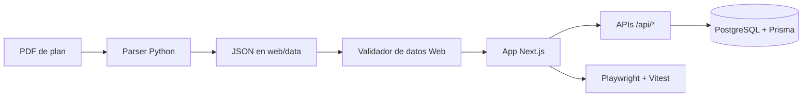

# UNS Correlativas Parser + Web

Documentacion integral del proyecto completo:
- parser PDF -> JSON estructurado,
- validacion de contrato de datos,
- aplicacion web Next.js con progreso por usuario,
- flujo de datos y operacion end-to-end.

## 1) Que resuelve este proyecto

Este repo transforma planes de estudio en PDF a una estructura JSON consistente y publica esa informacion en una app web para:
- visualizar materias y correlativas,
- gestionar el progreso del usuario,
- sincronizar progreso con base de datos,
- operar roles (USER, MODERATOR, ADMIN) con auditoria.

## 2) Arquitectura de alto nivel



## 3) Estructura principal del repositorio

```text
.
|-- app.py                          # Entrypoint parser CLI
|-- core/
|   |-- parser/                     # Extraccion, limpieza, parseo y contrato
|   `-- correlativas/               # Evaluacion de habilitacion por estado
|-- scripts/
|   `-- generar_json.py             # Wrapper CLI legado
|-- tests/                          # Tests parser + contrato + fixtures
|-- pdf/                            # Fixtures PDF
`-- web/
    |-- app/                        # Next.js App Router (paginas + api routes)
    |-- components/                 # Componentes React por dominio
    |   |-- plan/                   # PlanViewer, PlanHeader, PlanFilters, PlanTabBar, OrientationSelector, PlanStatus
    |   |-- materias/               # MateriaCard, MateriasGrid, AnioSection, GrupoMaterias
    |   |-- kanban/                 # KanbanPlan (vista tablero con drag & drop)
    |   |-- mapa/                   # MapaPlan, Toolbar, nodeTypes
    |   |   `-- panels/             # DetailPanel, EditorPanel, BestPathPanel
    |   |-- schedule/               # WeeklySchedule, ScheduleBlockForm
    |   |-- auth/                   # LoginActions, HomeSessionPanel
    |   |-- profile/                # ProfileWorkspace, AdminRoleManager
    |   `-- onboarding/             # PlanOnboarding
    |-- data/                       # JSON de planes publicados
    |-- hooks/                      # usePlanState, useSchedule, useOnboarding
    |-- lib/                        # Logica de negocio y servicios
    |   |-- plan/                   # Dominio academico (evaluarCorrelativas, materiaViewModel, filtros, progreso...)
    |   |-- mapa/                   # Logica pura del grafo (graphUtils, bestPath)
    |   |-- data/                   # Carga y validacion de planes (carreras, planDataLoader, planValidation...)
    |   |-- db/                     # Capa de base de datos (prisma, userProductContext, audit, actividad...)
    |   |-- auth/                   # Permisos y autenticacion (roles, authz, authProviders)
    |   |-- schedule/               # Validacion del planificador horario
    |   `-- ui/                     # Tokens de diseno y estilos de cards
    |-- prisma/                     # Schema y migraciones
    `-- tests/e2e/                  # Playwright end-to-end
```

## 4) Flujo completo (end-to-end)

1. Un PDF de carrera entra al parser.
2. El parser extrae texto, limpia ruido y detecta materias/correlativas.
3. Se arma JSON con `plan`, `materias`, `agrupadores`.
4. El contrato parser valida shape y consistencia minima.
5. El JSON se guarda en `web/data`.
6. La web carga el JSON via `loadPlanData` y ejecuta validacion de consistencia.
7. El usuario interactua con el plan (estados de materias).
8. APIs de progreso aplican resolucion `last-write-wins` y guardan snapshots en DB.
9. Se registran eventos de auditoria y actividad de usuario.
10. E2E y validadores batch aseguran que datos y comportamiento sigan correctos.

## 5) Requisitos

- Node.js 20+
- npm 10+
- Python 3.11+
- PostgreSQL accesible para `web`

## 6) Setup rapido

### 6.1 Parser (Python)

Desde la raiz del repo:

```bash
python3 -m venv .venv
source .venv/bin/activate
pip install -r requirements.txt
```

### 6.2 Web (Next.js + Prisma)

```bash
cd web
npm install
cp .env.example .env.local
```

Importante para Prisma CLI:
- Prisma toma variables desde `.env` por defecto.
- Si usas `.env.local`, ejecuta scripts `*:env` o sourcea variables explicitamente.

Ejemplo:

```bash
set -a && . ./.env && . ./.env.local && set +a && npm run prisma:status:env
```

## 7) Variables de entorno clave (web)

Definidas en `web/.env.example`:

- `DATABASE_URL`
- `DATABASE_URL_E2E` (opcional)
- `AUTH_SECRET`, `AUTH_URL`
- `NEXTAUTH_SECRET`, `NEXTAUTH_URL`
- `ADMIN_SEED_EMAIL`
- `AUTH_ENABLE_DEV_LOGIN`
- `NEXT_PUBLIC_ENABLE_DEV_LOGIN`
- `AUTH_ALLOW_DEV_ROLE_OVERRIDE`
- `NEXT_PUBLIC_ALLOW_DEV_ROLE_OVERRIDE`
- `AUTH_DEV_LOGIN_EMAIL_ALLOWLIST`

## 8) Parser: uso y contrato

### 8.1 Entrypoints parser

- `app.py` (entrypoint principal)
- `core/parser/cli.py` (orquestacion CLI)
- `scripts/generar_json.py` (wrapper compatible)

### 8.2 Generar JSON desde PDF

Desde la raiz:

```bash
python app.py pdf/arquitectura.pdf web/data/arquitectura.json
```

Opciones utiles:

```bash
python app.py pdf/arquitectura.pdf web/data/arquitectura.json --indent 2
python app.py pdf/arquitectura.pdf web/data/arquitectura.json --ensure-ascii
python app.py pdf/arquitectura.pdf web/data/arquitectura.json --skip-contract-validation
```

### 8.3 Contrato parser -> JSON

Archivo: `core/parser/contract_validator.py`

Valida, entre otros:
- `plan.carrera`, `plan.universidad`, `plan.codigo_plan`
- `materias[]` con campos requeridos (`id`, `nombre`, `anio`, `cuatrimestre`, `tipo`, `categoria`, etc.)
- estados de correlativas (`cursada`, `aprobada`, o `null`)
- referencias de `grupo_opcion` y `agrupadores`
- referencias a IDs inexistentes (warning)

Regla actual:
- errores bloquean salida (`exit 1`),
- warnings no bloquean (se informan por consola).

## 9) Web: ejecucion, migraciones y seed

Desde `web/`:

```bash
npm run dev
npm run build
npm run start
npm run lint
```

Prisma:

```bash
npm run prisma:generate
npm run prisma:migrate
npm run prisma:migrate:env
npm run prisma:deploy
npm run prisma:deploy:env
npm run prisma:status:env
npm run db:seed
npm run db:prepare
npm run prisma:studio
```

## 10) Flujo funcional en producto (usuario)

1. Usuario entra al home (`/`) y selecciona carrera.
2. Se abre plan (`/planes/[carrera]`) y se carga JSON/version.
3. Onboarding puede mostrarse por estado de perfil o query `onboarding=1`.
4. Cambios de estado de materias llaman `PUT /api/progreso`.
5. Se persiste snapshot por usuario/plan/version y se registra actividad.
6. Perfil (`/perfil`) permite gestionar carreras inscriptas y carrera activa.
7. Admin (`/admin`) gestiona roles y consulta auditoria.

## 11) Endpoints API principales

- `GET /api/materias/[carrera]`
- `GET|PUT|DELETE /api/progreso`
- `POST /api/progreso/sync`
- `GET|PUT /api/perfil/contexto`
- `GET|POST /api/perfil/onboarding`
- `POST /api/perfil/plan-visit`
- `GET /api/perfil/resumen`
- `PATCH /api/admin/users/[userId]/role`
- `GET /api/admin/auditoria`
- `GET|POST /api/auth/[...nextauth]`

## 12) Reglas de dominio importantes

### 12.1 Estados de materia

Orden de avance:
- `no_cursada` -> `cursada` -> `aprobada`

### 12.2 Correlativas

- `para_cursar` controla habilitacion para cursar.
- `para_rendir` controla habilitacion para rendir.
- Puede referenciar materia o agrupador.

### 12.3 Sincronizacion de progreso

Estrategia:
- `last-write-wins` por timestamp (`updatedAt`).

## 13) Testing y calidad

### 13.1 Parser (Python)

Desde la raiz, con venv activa:

```bash
python -m unittest discover -s tests -p "test_*.py"
```

Incluye:
- `tests/test_parser_cli.py`
- `tests/test_parser_contract_validator.py`
- `tests/test_parser_fixtures.py`

### 13.2 Web unit tests (Vitest)

Desde `web/`:

```bash
npm test -- --run
npm run test:watch
```

### 13.3 Web E2E (Playwright)

Desde `web/`:

```bash
npm run test:e2e
```

### 13.4 Validacion batch de datos publicados

Desde `web/`:

```bash
npm run validate:data
npm run validate:data:json
npm run validate:data:strict
npm run check:premerge
```

## 14) Guia de publicacion de una nueva carrera/version

1. Agregar PDF fixture en `pdf/`.
2. Generar JSON con parser CLI.
3. Validar contrato parser (automatico en CLI).
4. Registrar archivo en configuracion de carreras/versiones web.
5. Ejecutar `npm run validate:data` en `web/`.
6. Correr unit + e2e.
7. Revisar visualmente home, plan y correlativas.
8. Hacer commit y push.

## 15) Troubleshooting rapido

### Prisma no toma variables de `.env.local`

Usar scripts `*:env` o source manual:

```bash
set -a && . ./.env && . ./.env.local && set +a && npm run prisma:migrate
```

### Error "No se encontro el PDF de entrada"

Verificar ruta relativa/absoluta del archivo PDF de entrada.

### JSON invalido en web

Correr:

```bash
cd web
npm run validate:data:strict
```

Revisar reporte por carrera/version y corregir shape o referencias.

### Onboarding se muestra mas de una vez por query

El flujo actual consume `onboarding=1` en modo one-shot. Si reaparece, revisar logica en `PlanViewer` y pagina `planes/[carrera]`.

## 16) Documentacion complementaria

- Guia web detallada: `web/README.md`
- Esquema DB: `web/prisma/schema.prisma`
- Contrato parser: `core/parser/contract_validator.py`
- Carga y validacion web: `web/lib/data/planDataLoader.ts`, `web/lib/data/planValidation.ts`

## 17) Checklist de produccion

Antes de publicar, usar este flujo:

1. Preparar variables de entorno de produccion en `web/.env.local` (base: `web/.env.production.example`).
2. Ejecutar chequeo integral:

```bash
npm run check:prod
```

3. Aplicar migraciones productivas:

```bash
cd web
npm run prisma:deploy
```

4. Generar y levantar build:

```bash
cd web
npm run build
npm run start
```

Que valida `check:prod`:

- consistencia de variables de auth y seguridad,
- provider de autenticacion habilitado (Google o dev-login restringido),
- validacion de datos publicados (bloquea issues criticos),
- lint, tests unitarios y build de Next.js.
